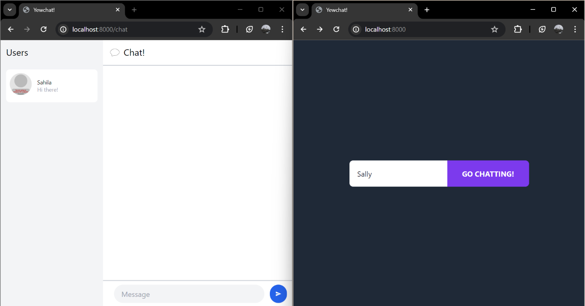
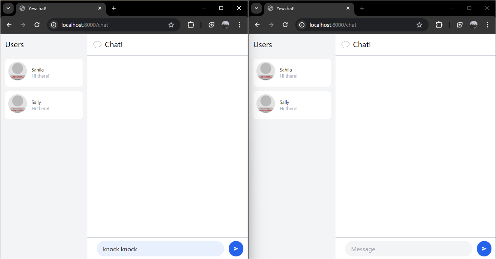
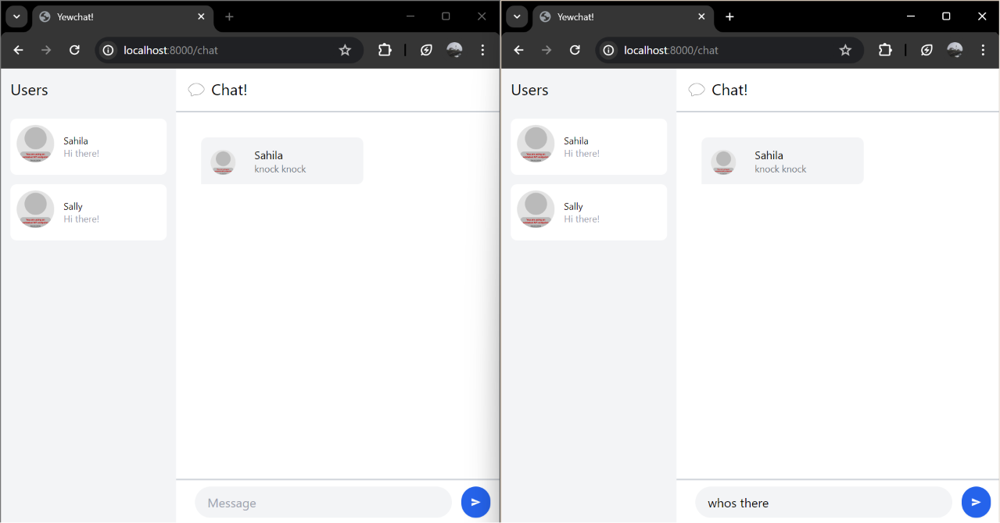
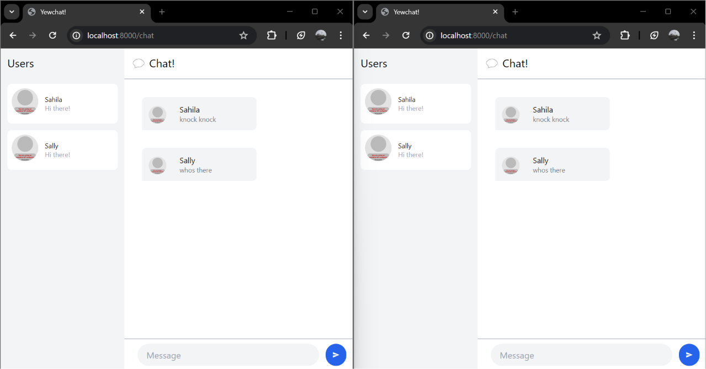
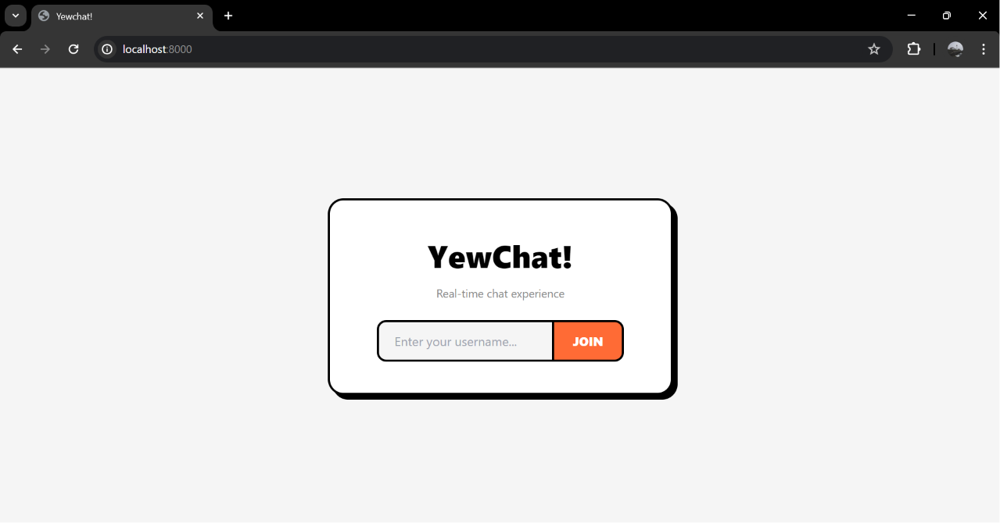
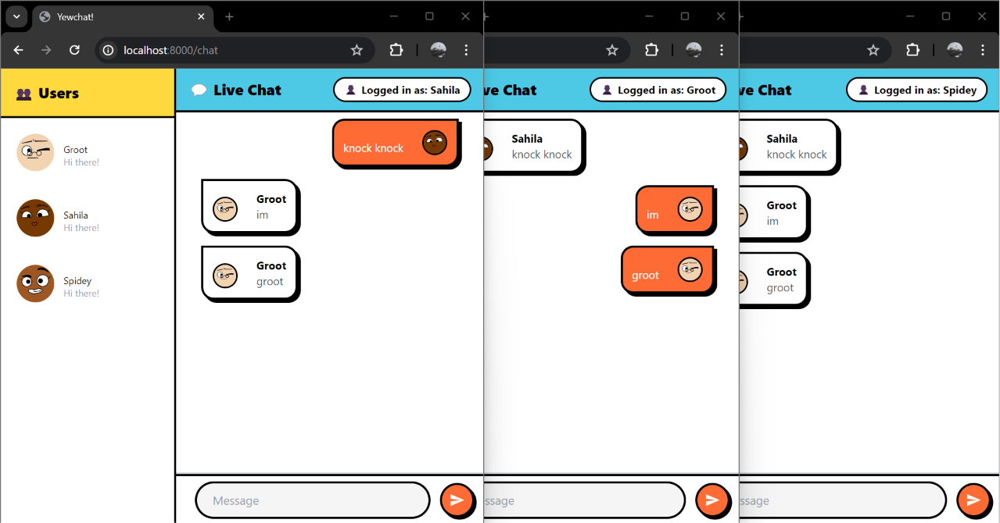
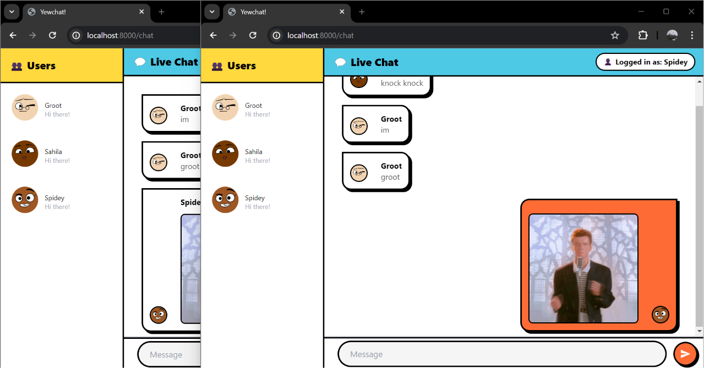

## Experiment 3.1: Original Code

## Experiment 3.2: Be Creative!

### Modifikasi yang Dilakukan

**1. Redesign UI**:
Mengubah tampilan dengan style dan color palette baru: oranye (#FF6B35), kuning (#FFD93D), 
biru muda (#4DC9E6), border hitam tebal, dan box shadow. Perubahan diterapkan pada halaman login, header, sidebar, message bubble, dan input area.

**2. Avatar**:
Update URL DiceBear lama  ke API baru:
`https://api.dicebear.com/9.x/adventurer-neutral/svg?seed={username}`

**3. Posisi Bubble Pesan**:
Bubble pesan milik sendiri tampil di kanan, sedangkan bubble pesan orang lain di kiri. Implementasi dengan mengecek `m.from == self.username`.

**4. Auto-render Gambar**:
Link berakhiran `.gif`, `.jpg`, `.jpeg`, `.png` otomatis ditampilkan sebagai gambar/GIF di bubble chat.

**5. Logged In As**:
Header menampilkan username yang sedang login di pojok kanan atas.

## Bonus: Rust Websocket server for YewChat!

Server JavaScript (SimpleWebsocketServer) diganti dengan server Rust dari Tutorial 2. YewChat tidak perlu diubah sama sekali karena format JSON yang digunakan tetap sama.

Yang diubah hanya `src/bin/server.rs` dari code Tutorial 2:

**1. Parse JSON**:
Server yang awalnya hanya menangani plain text dibuat jadi parse JSON dari YewChat yang memiliki 2 tipe pesan: `register` (saat user login) dan `message` (saat user kirim pesan).

**2. Shared State dengan `Arc<Mutex<Vec<String>>>`**:
Daftar user aktif disimpan dalam `Arc<Mutex<Vec<String>>>` untuk mendukung async task. Setiap connection client berjalan di task terpisah, sehingga perlu sesuatu untuk sharing data yang thread-safe.

**3. Broadcast Format**:
Setiap event dibroadcast ke client dengan awalan/prefix:
- `__MSG__:` untuk pesan chat. Format JSON `{messageType: "message", data: ...}`
- `__USERS__:` untuk update list user. Format JSON `{messageType: "users", dataArray: [...]}`

**4. Auto-update User List**:
Setiap kali ada user register atau disconnect, server langsung broadcast list user terbaru ke semua client yang terhubung. Sehingga "Users" di sidebar YewChat bisa selalu update secara realtime.   

**Preferensi**:
Secara penulisannya, saya lebih suka JavaScript version karena kodenya jauh lebih singkat dan mudah untuk dibaca. Jika ada bug juga bisa lebih cepat didebug. Tapi secara production/reliability, tentu Rust version lebih bagus karena kesalahan-kesalahan seperti lupa handle edge case atau akses data yang tidak aman langsung ketahuan saat compile, bukan saat runtime. Jadi lebih tenang kalau sudah jalan, tidak tiba-tiba crash di tengah jalan.